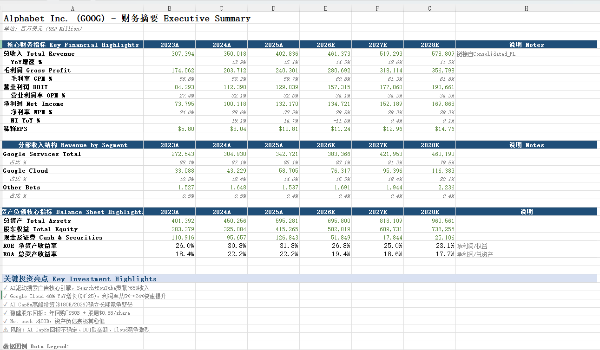
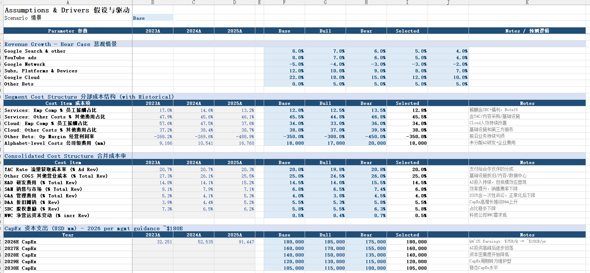
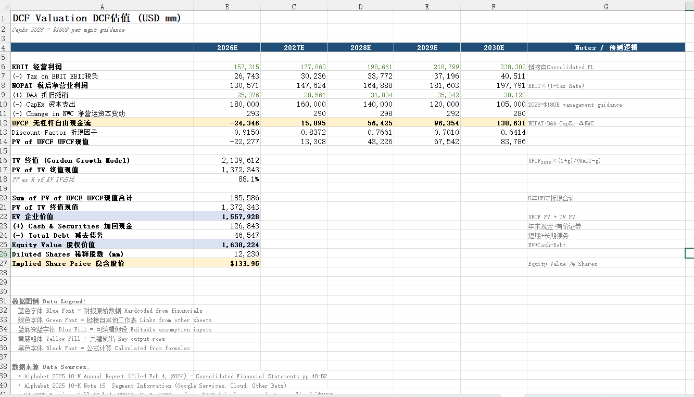
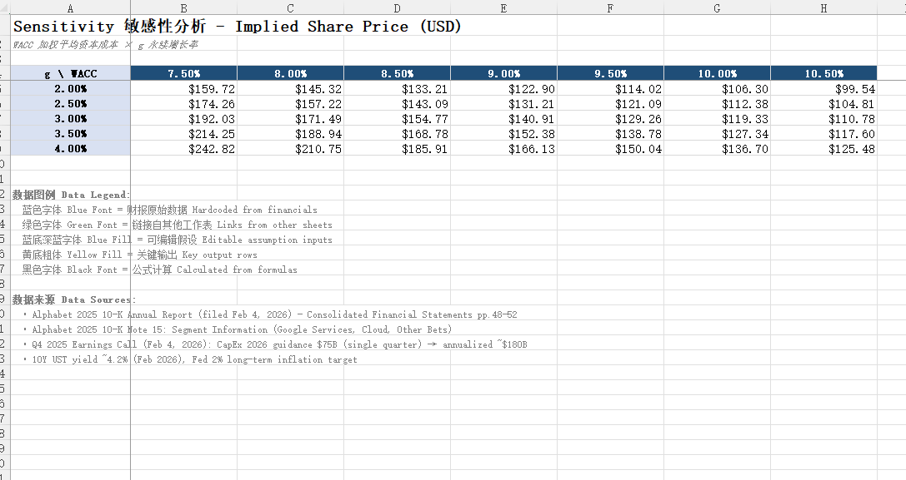
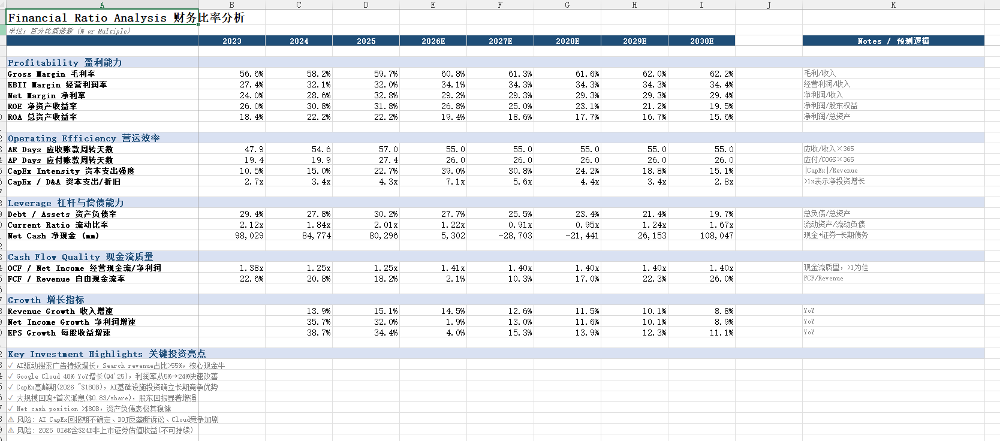

# 谷歌（Alphabet）财务模型（基于最近 4 年年报 2022–2025）

## 项目说明
基于**最近 4 年年报**（2022、2023、2024、2025 年 10-K）的历史财务数据，构建投行级**三表联动 + 分部驱动 DCF** 财务模型。年报 PDF 已随仓库提供，见下方「年报文件」。

## 主交付件
### `Alphabet_IB_Model_v5.xlsx` — 11-Tab 投行级完整模型（最新版）

| Tab | 内容 |
|---|---|
| **Cover** | 封面、模型特色、使用步骤 |
| **Key_Summary** | 执行摘要仪表板：核心KPI + 分部收入结构 + BS亮点 + ROE/ROA + 投资亮点与风险 |
| **Assumptions** | 情景切换(Base/Bull/Bear) + WACC + 6业务线增速 + 分部成本驱动 + 合并口径成本率 + CapEx绝对值 + BS假设(周转天数等)，每个假设均附 2022–2025 历史锚点 |
| **Segment_Revenue** | 6业务线自底向上 + Revenue Mix% + yoy% |
| **Segment_PL** | 分部级P&L：Services/Cloud(Emp Comp + Other Costs) + Other Bets + Alphabet-level + **交叉验证** |
| **Consolidated_PL** | 合并利润表：TAC/COGS/R&D/S&M/G&A/EBIT(分部驱动)/NI/EPS + 每行%/yoy% |
| **BS** | **完整资产负债表**：流动/非流动资产 + 流动/非流动负债 + 股东权益 + **Balance Check** |
| **Cash_Flow** | CFO(含WC明细) + CapEx + FCF + FCF Margin + Buyback + Dividends |
| **DCF** | UFCF → 折现 → 终值 → EV → Equity → 每股价值 |
| **Sensitivity** | WACC × g 双变量 → 每股隐含价值 |
| **Ratio_Analysis** | 盈利能力(GPM/OPM/NPM/ROE/ROA) + 营运效率(AR Days/AP Days/CapEx强度) + 杠杆(D/A/Current Ratio/Net Cash) + 现金流质量 + 增长指标 + 投资亮点 |

### 模型核心特色
1. **三表联动**：P&L → BS → CF 完整链接，BS Balance Check 验证资产=负债+权益
2. **双层P&L交叉验证**：Segment_PL(分部) 与 Consolidated_PL(合并) 的 EBIT 恒等
3. **Notes列**：每行都有预测逻辑说明（column J）
4. **数据图例**：蓝字=原始数据、绿字=跨表链接、蓝底=可编辑假设、黄底=关键输出
5. **历史锚点**：每个假设展示 2022–2025 四年历史值
6. **CapEx绝对值**：2026=$180B（管理层指引），非收入百分比
7. **三情景CHOOSE**：一键切换Base/Bull/Bear

### 年报文件（仓库内 PDF，共 4 份）
- `goog-10-k-q4-2022.pdf` — 2022 年 10-K
- `goog-10-k-2023-final.pdf` — 2023 年 10-K
- `goog-10-k-2024.pdf` — 2024 年 10-K
- `GOOG-10-K-2025.pdf` — 2025 年 10-K（filed Feb 4, 2026）

模型历史数据与分部信息取自上述年报（合并报表、Note 15 分部等）。CapEx 指引参考 Q4 2025 Earnings Call；宏观参数参考 FRED / Reuters（10Y UST 等）。

### 数据图例
| 格式 | 含义 |
|---|---|
| 蓝色字体 | 财报原始数据 (Hardcoded) |
| 绿色字体 | 跨表链接 (Links) |
| 蓝底深蓝字体 | 可编辑假设 (Assumption inputs) |
| 黄底粗体 | 关键输出行 (Key outputs) |
| 黑色字体 | 公式计算 (Formulas) |
| 灰色斜体 | 百分比/备注行 |

## 使用方式
1. 打开 `Alphabet_IB_Model_v5.xlsx`
2. **Key_Summary** 页一览核心指标
3. 在 **Assumptions** 页 B2 选择情景 → 只修改**蓝底**单元格
4. 所有下游自动联动：Revenue → Segment PL → Consolidated PL → BS → CF → DCF
5. 检查 **Segment_PL** 交叉验证行 + **BS** Balance Check
6. 查看 **DCF** 每股价值 + **Sensitivity** 估值区间
7. **Ratio_Analysis** 查看综合财务健康度
8. 每行 **Notes列** (J列) 解释预测逻辑

## 模型截图

将 Excel 各 Tab 截图按 `screenshots/README.md` 的命名放入 `screenshots/` 后，可在此展示（建议至少包含 Key_Summary、Assumptions、DCF、Sensitivity、Ratio_Analysis）：

| Tab | 截图 |
|-----|------|
| Key_Summary |  |
| Assumptions |  |
| DCF |  |
| Sensitivity |  |
| Ratio_Analysis |  |

完整截图清单与命名见 `screenshots/README.md`。

## 辅助文件与文档

- **年报**：仓库内包含 2022–2025 年 10-K 共 4 份 PDF（见上方「年报文件」）。
- **运行**：`build_ib_model_v5.py` — 生成 v5 Excel 的脚本（依赖 `openpyxl`，可重复执行）
- **过程**：`DEVELOPMENT_LOG.md` — 开发过程与迭代记录
- **假设与结果**：`financial_model.md` — 基准假设、预测结果与估值摘要
- **Skill 与结构**（`docs/`）：
  - `docs/SKILL-ib-financial-model.md` — 投行级财务模型构建 Skill 说明（三表联动、分部 DCF、openpyxl 规范）
  - `docs/example-structure.md` — 11-Tab 行结构与跨表引用说明
